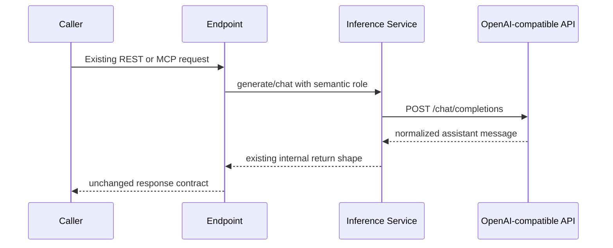
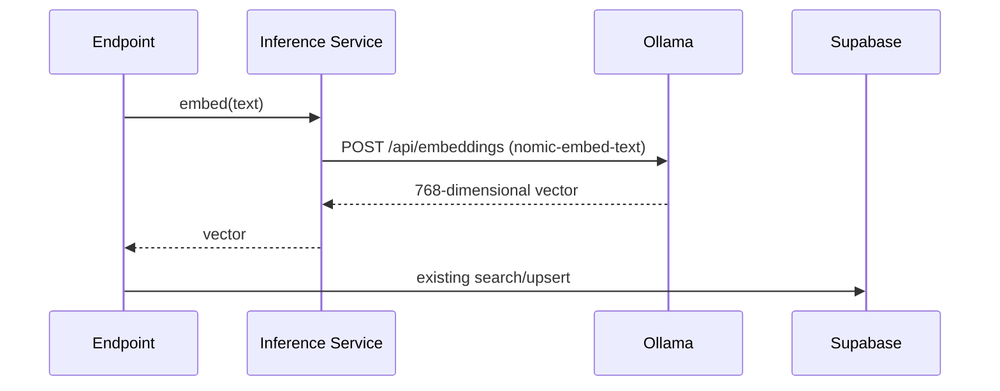

# Inference Service

Context Engine uses an internal inference service. It does not add a process,
port, HTTP hop, REST endpoint, or MCP tool.

```text
Endpoints and agents
        |
        v
InferenceService
        |-- generation roles --> Ollama or OpenAI-compatible provider
        `-- embedding role ----> Ollama (default: nomic-embed-text)
```

The generation and embedding providers are configured independently. This
allows cloud-hosted generation while retaining the existing local embedding
model and the 768-dimensional vectors already stored in Supabase.

## Configuration

Existing installations require no changes. When no `INFERENCE_*` variables are
set, all roles use the existing `OLLAMA_*` values.

For an OpenAI-compatible generation endpoint with local Ollama embeddings:

```env
INFERENCE_GENERATION_PROVIDER=openai_compatible
INFERENCE_GENERATION_ENDPOINT=https://provider.example/v1
INFERENCE_GENERATION_API_KEY=<secret>
INFERENCE_FAST_MODEL=<model>
INFERENCE_REASONING_MODEL=<model>
INFERENCE_AGENT_MODEL=<model>
INFERENCE_SELECTION_MODEL=<model>
INFERENCE_VERIFICATION_MODEL=<model>

INFERENCE_EMBEDDING_PROVIDER=ollama
INFERENCE_EMBEDDING_ENDPOINT=http://localhost:11434
INFERENCE_EMBEDDING_MODEL=nomic-embed-text
```

`openai`, `openrouter`, and `vllm` are accepted aliases for the
`openai_compatible` transport. The configured endpoint must expose:

- `POST /chat/completions`
- `GET /models`
- OpenAI-compatible tool calls
- JSON Schema response formatting for `/agents/run`

The provider may also expose `POST /embeddings`, but the recommended migration
keeps embeddings on Ollama.

## Request sequences

Generation:



Vector search and indexing:



## Adding a provider

1. Implement every method in `app/inference/provider.py`.
2. Translate provider payloads in `app/inference/providers/`; do not leak
   provider response shapes into endpoints or agents.
3. Register the provider name in `app/inference/factory.py`.
4. Add provider translation and service-routing tests.
5. Do not change REST models, MCP tools, vector schema, or endpoint code.

Streaming, retries, failover, cost routing, and capability-based selection are
extension points, not active behavior. Add them in the service rather than in
callers.

## Vector compatibility

The current Supabase schema expects 768 dimensions. Do not change
`INFERENCE_EMBEDDING_MODEL` or the embedding provider for an existing corpus
unless the replacement produces compatible vectors. A model change normally
requires a deliberate re-index into a compatible schema.
